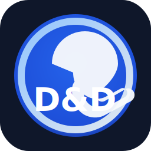

<div align="center">
  

  # RPG Sistema Criador de Fichas

  **Criador de fichas responsivo para D&D e sistemas semelhantes.**

  [](https://github.com/Samwns/RPG-Sistema-Criador-de-fichas/releases/latest)
  [](https://samwns.github.io/RPG-Sistema-Criador-de-fichas/)
  [](LICENSE)

  [**Crie a sua ficha**](https://samwns.github.io/RPG-Sistema-Criador-de-fichas/)
</div>

## Sobre

Este projeto fornece um criador de fichas para RPG com foco em D&D, usando uma interface responsiva inspirada em fichas editoriais. O sistema inclui:

- Criação e salvamento local de personagens
- Distribuição de atributos, classes, perícias, magia e vida
- Compra de habilidades com nome, descrição e imagem
- Uma habilidade liberada a cada 3 pontos distribuídos, limitada pelo nível
- Edição e exclusão das habilidades compradas
- Banner e retrato independentes
- Tema dinâmico extraído das cores do banner ou retrato
- Compra inicial de armas, armaduras e itens por pontos
- Rolagens 3D de d4, d6, d8, d10, d12, d20 e d100
- Combinações de vários tipos de dados na mesma rolagem
- Ataques e danos conectados ao mesmo tabuleiro 3D
- Progressão por XP, subclasses, validação de multiclasse e magias prontas por classe
- Seleção de raça e subraça/linhagem com opções atuais e legadas adaptadas
- Compra e preparação de magias até o 9º círculo
- Imagens por arquivo local ou URL para banner, retrato e habilidades
- Sistema com subabas didáticas para raças, classes, perícias, feitiços, habilidades e equipamentos

O design funciona em dispositivos móveis e desktop.

## Testes

A suíte end-to-end cria personagens físicos, conjuradores e de Shattered Rebirth. Ela também cobre habilidades, magias, recursos de combate, loja, inventário, equipamento, persistência, múltiplas fichas e exclusão definitiva.

```bash
npm install
npx playwright install chromium
npm test
```

## Regras abertas

Este projeto usa uma adaptação em português das regras abertas do SRD 5.2.1.

This work includes material from the System Reference Document 5.2.1 (“SRD 5.2.1”) by Wizards of the Coast LLC, available at https://www.dndbeyond.com/srd. The SRD 5.2.1 is licensed under the Creative Commons Attribution 4.0 International License, available at https://creativecommons.org/licenses/by/4.0/legalcode.
